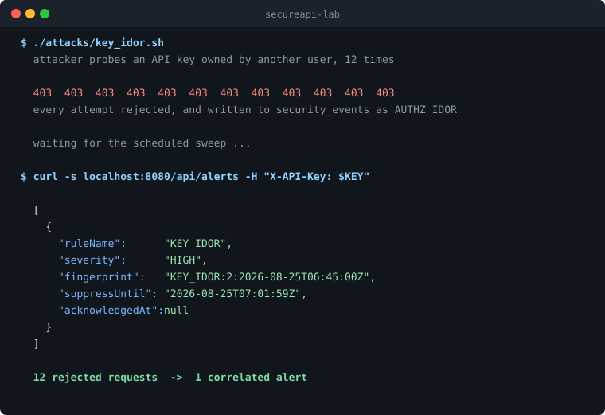

# SecureAPI Lab

A REST API for managing scoped API keys, with security monitoring built in.

Most sample APIs stop once authentication works. This one records every authentication and
authorization outcome to an append-only audit trail, and runs a scheduled detection engine over
that trail to raise deduplicated alerts for brute force, password spraying, key enumeration and
token replay.



Twelve rejected requests from one attacker become a single correlated alert, not twelve.

I built it as an applied study of the
[OWASP API Security Top 10 (2023)](https://owasp.org/API-Security/editions/2023/en/0x00-header/),
with a focus on A09, Security Logging and Monitoring Failures.

## Contents

- [What it does](#what-it-does)
- [Running it](#running-it)
- [Authentication](#authentication)
- [Endpoints](#endpoints)
- [The audit trail](#the-audit-trail)
- [The detection engine](#the-detection-engine)
- [Security controls](#security-controls)
- [Design decisions and accepted risks](#design-decisions-and-accepted-risks)
- [Status](#status)

## What it does

A user registers, logs in, and manages API keys scoped to specific permissions. Keys are the owned
resource, which makes them the natural thing to test authorization against: who can read, revoke,
or escalate one.

Anything security-relevant is published as an event, persisted, and read back by detection rules:

```
HTTP request
   -> a filter or service makes an authz decision
   -> publishes a SecurityContextEvent
   -> SecurityAuditListener persists it to security_events
   -> DetectionScheduler sweeps the table on a timer
   -> a rule crosses its threshold
   -> a deduplicated row lands in alerts
```

The audit write runs in its own transaction. If a request publishes an event and then throws, the
event is still recorded, so rejecting an attack does not erase the record that it happened.

## Running it

**Check your JDK first.** This is the step that decides whether anything else works.

You need **JDK 17 to 21**. Lombok 1.18.30, pinned by Spring Boot 3.2.5, can't run its annotation
processor on JDK 22 or newer, and the build fails with around 90 "cannot find symbol" errors on
Lombok-generated getters. That looks like broken code and isn't. If your default JDK is newer:

```bash
export JAVA_HOME=$(/usr/libexec/java_home -v 21)
```

Start Postgres:

```bash
docker compose up -d
```

Set the four environment variables. The JWT secrets have to be at least 32 characters; this is
checked at startup, not just documented:

```bash
export DB_USERNAME=secureapi
export DB_PASSWORD=secureapi
export JWT_ACCESS_SECRET=<32+ character secret>
export JWT_REFRESH_SECRET=<32+ character secret>
```

Run it. Flyway applies migrations V1 through V6 on first start:

```bash
mvn spring-boot:run
```

| | |
|---|---|
| API | `http://localhost:8080` |
| Swagger UI | `http://localhost:8080/swagger-ui/index.html` |
| OpenAPI spec | `http://localhost:8080/v3/api-docs` |

## Authentication

There are two credential types, and they are not interchangeable.

Sessions use cookies, for user-owned resources. Login returns a short-lived access token and a
refresh token, both as `HttpOnly` `Secure` `SameSite=Strict` cookies. The access token is never
exposed to JavaScript, so injected script can't read it. Logging in again revokes any refresh
tokens issued earlier.

API keys use a header, for the alert feed. The `X-API-Key` header carries scopes (`ALERTS_READ`,
`ALERTS_WRITE`). Only a hash and a short non-secret prefix are stored. The plaintext is shown once
at creation and can't be recovered afterward.

Sending the wrong credential type gets a 403 rather than being quietly accepted. An API key on
`/api/keys` is rejected, and a cookie session on `/api/alerts` is rejected. Key management is
login-only, so even a stolen API key can't create another key regardless of its scopes.

State-changing requests need CSRF protection: the `XSRF-TOKEN` cookie sent back as an `X-XSRF-
TOKEN` header. Swagger UI doesn't send that header, so writes will 403 from the UI. Use the
scripts in
[`http/`](http/) for those.

## Endpoints

| Method | Path | Credential | Notes |
|---|---|---|---|
| `POST` | `/api/auth/register` | none | rate limited |
| `POST` | `/api/auth/login` | none | rate limited, lockout-aware |
| `GET` | `/api/auth/refresh` | refresh cookie | rotates the token; reuse is treated as theft |
| `POST` | `/api/auth/logout` | session | revokes refresh tokens |
| `GET` | `/api/auth/me` | session | |
| `GET` | `/api/users/{id}` | session | self or admin |
| `PUT` | `/api/users/{id}` | session | self or admin, allow-listed fields |
| `GET` | `/api/keys` | session | paginated, own keys only |
| `POST` | `/api/keys` | session | returns the plaintext key once |
| `DELETE` | `/api/keys/{id}` | session | owner or admin |
| `GET` | `/api/alerts` | `X-API-Key` | needs `ALERTS_READ` |
| `POST` | `/api/alerts/{id}/acknowledge` | `X-API-Key` | needs `ALERTS_WRITE` |

## The audit trail

`security_events` is append-only. Eleven event types are wired and persisted:

| Event | Emitted when |
|---|---|
| `AUTH_SUCCESS` | login succeeds |
| `AUTH_FAILURE` | login fails, including against a locked or nonexistent account |
| `AUTH_REPLAY` | a revoked refresh token is presented |
| `AUTHZ_DENIED` | an API key lacks the required scope |
| `AUTHZ_IDOR` | a caller touches a resource it doesn't own |
| `RATE_LIMIT_HIT` | the per-IP bucket is empty |
| `ACCOUNT_LOCKED` | failures cross the lockout threshold |
| `API_KEY_CREATED` / `API_KEY_REVOKED` / `API_KEY_USED` / `API_KEY_REJECTED` | key lifecycle |

The `principal` column means different things depending on `event_type`. Auth events store the
attempted email, because on a failed login the account might not exist, and spray traffic against
unregistered addresses is worth recording (a foreign key here would reject exactly those rows).
Resource events store an id instead: a user id on `AUTHZ_IDOR`, a key id on `AUTHZ_DENIED`. Every
rule filters on `event_type` before it reads `principal`.

The schema follows one rule for this: owned resources get foreign keys, observed behaviour
doesn't.

## The detection engine

Rules implement a `DetectionRule` interface and are injected as a list, so adding a detection is
one `@Component` class. A scheduler sweeps the table on a timer instead of evaluating inline.
Inline evaluation would run an aggregate query on every event, and event volume is highest during
an attack, which is the worst time to be doing the most work. The scheduler's cost stays flat.

| Rule | Pattern | Severity | Suppression |
|---|---|---|---|
| `BruteForceRule` | 10+ `AUTH_FAILURE` from one source | MEDIUM | 1h |
| `PasswordSprayingRule` | 10+ distinct principals from one source | HIGH | 30m |
| `KeyIdorRule` | 10+ `AUTHZ_IDOR` from one principal | HIGH | 15m |
| `WrongScopeKeyRule` | 10+ `AUTHZ_DENIED` | MEDIUM | 1h |
| `RevokedKeyReuseRule` | 10+ `API_KEY_REJECTED` | HIGH | 30m |
| `TokenReplayRule` | 10+ `AUTH_REPLAY` | CRITICAL | 5m |

All six use a 10-minute look-back window.

Brute force and password spraying read the same events and differ by one word in SQL: `COUNT(*)`
versus `COUNT(DISTINCT principal)`. One counts total failures from a source, the other counts how
many different accounts that source tried.

### Alert deduplication

An engine that fires an alert on every scan trains operators to ignore it. Alerts are deduplicated
on a `rule + entity + time-bucket` fingerprint, with the bucket aligned to the rule's suppression
window. While an alert is open, a continuing attack pushes its `suppress_until` forward instead of
inserting a duplicate.

The uniqueness constraint is partial, covering only unacknowledged alerts:

```sql
CREATE UNIQUE INDEX idx_alerts_fingerprint_unacked
    ON alerts (fingerprint) WHERE acknowledged_at IS NULL;
```

Without the `WHERE` clause, acknowledging an alert would make the next attack from the same source
collide with the handled one and get absorbed, so the system would go quiet right after someone
responded to it. The partial index keeps the history and still lets a new incident open.

## Security controls

Authorization. BOLA (API1) and BFLA (API5) are handled as separate checks. Ownership checks ask
whose resource this is and emit `AUTHZ_IDOR`; scope checks ask whether the credential is allowed
to do this and emit `AUTHZ_DENIED`. Both return 403, and both are audited separately so the
detection engine can tell them apart.

Account lockout. Ten failures against one principal locks it for 15 minutes. Failures are counted
only since the principal's last successful login, so a real sign-in resets the count without any
extra bookkeeping. Locks expire on their own and aren't extended by attempts made while a lock is
already held.

Rate limiting. A token bucket (20 requests per minute per IP, greedy refill) on login and
register, the only two endpoints an unauthenticated caller can reach. It runs before both
authentication filters, so a flood is turned away before it costs a password hash. The lockout and
rate-limit thresholds are set so both are reachable: a single-account attack hits the lock first,
a spray across many accounts hits the limiter first.

Transport and headers. Strict CSP (`default-src 'none'`) on the API, plus HSTS, `no-referrer`, and
`nosniff`. The docs paths run on a separate filter chain with a CSP loose enough for Swagger UI's
own assets, scoped to those paths rather than loosening the whole app.

Resource enumeration. Probing an id you don't own and probing one that doesn't exist return byte-
identical responses on both `/api/keys/{id}` and `/api/users/{id}`: same status, same body, no id
echoed back. The distinction is recorded in the audit trail instead, so the SIEM sees enumeration
that the caller can't.

Input validation. Bean Validation on every request DTO, including a 12-character password minimum.
The partial-update endpoints use null-tolerant constraints on purpose: `null` is how the client
says "leave this field unchanged", so `@NotBlank` there would break updates.

Secrets. Passwords are BCrypt hashed. API keys are stored as a SHA-256 hash plus a 12-character
prefix (`sk_gin_` and five characters of the key), which is what lets a key be identified in a
list without revealing it; the full key is never stored and can't be recovered. JWT secrets come
from the environment and their length is checked at startup. `API_KEY_REJECTED` logs the key hash,
never the value that was presented.

## Design decisions and accepted risks

I'm listing these because a residual risk you chose to accept is worth saying out loud.

Registration reveals whether an email is in use. `POST /api/auth/register` returns 409 for an
existing account, which lets someone enumerate users. Hiding it means deferring the answer to an
email round-trip ("if this address is new, we've sent a link"), which needs infrastructure this
project doesn't have. The rate limiter makes bulk enumeration slow rather than impossible. Login
is different: it returns one generic message for wrong passwords, locked accounts, and unknown
users alike.

The lockout threshold is high on purpose. Hard lockout is a denial-of-service vector, since anyone
who knows a victim's email can lock them out. NIST SP 800-63B prefers throttling over aggressive
lockout for this reason, so the rate limiter does most of the work and the threshold sits at 10
instead of

Rate limiting keys on `getRemoteAddr()`. That's right for anonymous endpoints where you don't know
the caller yet. Behind a reverse proxy it would need `X-Forwarded-For` handling, and right now
everyone behind one NAT shares a bucket.

The bucket registry is unbounded. It holds one entry per source IP for the life of the process, so
an attacker rotating addresses grows the map without limit. That's fine at lab scale but a real
deployment needs eviction.

Most detection groups by source IP, so an attacker rotating addresses stays under the thresholds.
`KeyIdorRule` is the exception: it groups by the authenticated `principal`, which survives IP
rotation and is the stronger signal wherever the caller is known. The auth rules can't do the
same, since the whole point there is that you don't yet know who is calling.

Timestamps are `TIMESTAMP` without a zone, except `account_lockouts.locked_until`. The zone-less
columns are only ever compared inside SQL, which is safe. `locked_until` is compared against the
JVM clock, so it's `TIMESTAMPTZ`; as a zone-less column it read seven hours off and made every
lock look already expired.

## Status

Verified by hand against a running instance: authentication, the API-key lifecycle with ownership
and scope checks, the audit pipeline, all six detection rules with suppression, account lockout,
and rate limiting.

Unit tests cover API key generation and JWT verification, including rejection of tokens signed
with an unknown secret, modified after signing, expired, or presented to the wrong verifier.

Not done yet:

- Integration tests. Nothing yet exercises the endpoints, database or filter chain end to end, so the
authorization and detection behaviour above rests on manual verification rather than an automated
suite. This is the largest gap.
- Four event types are declared but not wired: `AUTH_LOGOUT` and the three `JWT_*` failures.
- Client errors that Spring rejects before reaching a controller (malformed JSON, a missing
`Content-Type`, a non-numeric path variable, a negative page size) currently return 500 rather
than 400.
- Attack scripts and a threat model.

## Stack

Java 17, Spring Boot 3.2.5, Spring Security, PostgreSQL 16, Flyway, Spring `JdbcClient` (no ORM,
every query is plain SQL), java-jwt, Bucket4J, springdoc-openapi.
